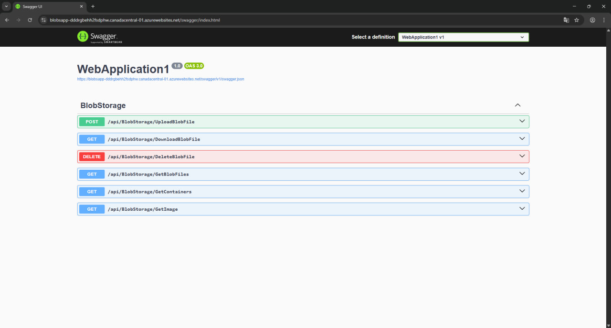

# Azure Blob Manager – Backend (ASP.NET Core)



## 🧠 Architecture
- ASP.NET Core Web API
- Azure Blob Storage SDK via `Azure.Storage.Blobs`
- Repository pattern with interface abstraction
- Swagger integration for API testing
- CORS support for client requests
- Environment-based configuration via `appsettings.json`
- Deployed to Azure App Service via GitHub Actions

---

## 🛠️ Endpoints

| Method | Endpoint                              | Description                  |
|--------|---------------------------------------|------------------------------|
| GET    | /api/BlobStorage/GetContainers        | Get all containers           |
| GET    | /api/BlobStorage/GetFiles?container=x | Get file list from container |
| GET    | /api/BlobStorage/Download?filename=x&container=y | Download blob     |
| DELETE | /api/BlobStorage/Delete?filename=x&container=y | Delete blob        |
| POST   | /api/BlobStorage/Upload               | Upload file (multipart/form) |

---

## 🔒 Environment Variables (in `appsettings.json`)
```json
{
  "ConnectionStrings": {
    "AzureBlobConnection": "<YOUR_BLOB_CONNECTION_STRING>"
  }
}
```

---

## 🚀 Deployment Instructions
- Configure `AZUREAPPSERVICE_...` secrets in GitHub
- Push to `master` branch – GitHub Actions triggers deploy via `master_webappclient.yml`

---

## 🔧 Tech Stack
- ASP.NET Core 7.0+
- Azure Blob Storage SDK
- Swagger / OpenAPI
- GitHub Actions

---

## 🚀 Extensibility
- Add authorization and roles
- Audit logs or version control of blobs
- File metadata tagging or indexing
